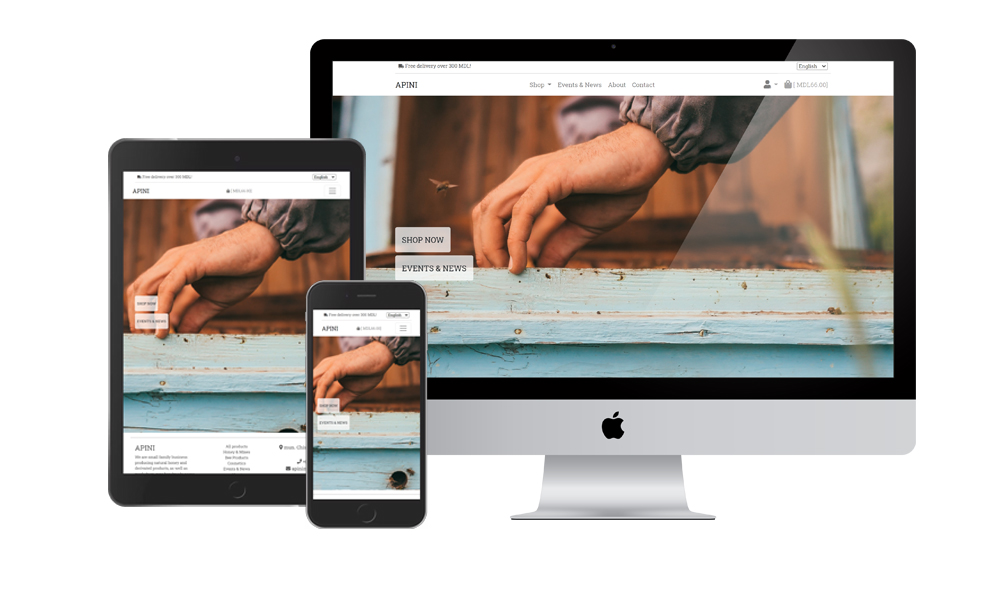

#  APINI MD

[View the live project here.](https://apinimd.herokuapp.com/)

The project objective is to create a full stack site around an business with e-commerce feature using Python with Django Framwork/PostgreSQL/AWS/Stripe payment methond and deploy the project to Heroku.

## User Experience (UX)

### Project Goals

Project goal is to create an online presence with online shop functionality for a small family business producing natural honey and derivated products, as well as made from-zero handmade soaps, shampoos, and cosmetics. 
The couple makes part of a small ecovillage project, created in the center of the Republic of Moldova 15 years ago inspired by permacultural and sustainable living principles.

#### As a Shopper, I want to:

- have access to the shop in one click
- view a list of all products and have quick access to purchase them
- view individual product details with description and stock information
- have a view on my purchase list at any time not to overspend
- sort products by Name/Categories/Price
- search for a product by name or description
- easily selected quantity and amount of selected product when purchasing it
- view all the items in my shopping bag with name/qty/grand total
- easily make changes and adjustments before my purchase/order
- easily enter payment information to check out with no unwanted delays
- feel my information is secured and be confident to provide required data to make an order/purchase
- view confirmation after checkout and receive an email with a confirmation of the order

####  As a User, I want to :

- have content in my native preffered language 
    (R.Moldova have 2 main spoken languages, Romanian and Russian)
- have a clean interface with a familiar layout
- create a personal account and be able to view and change my profile detail
- access and change my personal account information
- recover a forgotten password to my account
- have meaningful messages and confirmation of my interaction with the site 
    as confirmation emails and messages
- add/edit/delete a review to products

####  As an Admin/Store Owner, I want to :
- receive a copy of order to email
- have easy access to manage products
- add new products
- edit and update product description /images and availability
- remove products that are no longer needed 
- add/edit and update events and news section
- add/edit and update About section with new articles and links
- create and change promotional coupons

-   ### Design
“The simplest solution is almost always the best.”
-  Color Scheme: black/white/grey colors are used.
-   Typography: Roboto Slab is used throughout the site with fall back to Serif.
-   Imagery: All images are provided by business owner and have ownership over them.

### Wireframes
-   Wireframes - [View](https://xz3t.github.io/milestone-4/docs/wireframes.html)

## Features

- build using bootstrap grid system, all content is adjusted to be responsive for devices down to 320px and up to 4k.
- 3 languages available, page will load on browsers default language if not available will default to English.

### Database
- Heroku  used to store information.

### AWS
- all static files and media are stored with AWS in S3 bucket.

### Delivery Header
- delivery header contains information about free delivery threshold and language selector.
- header hides on scroll down to preserve page real estate.

### Navbar
- navbar is fixed and always remain on top of the page.
- includes all links for an easy navigation through all content.
- in mobile version all menu items are collapsed except "Shopping bag" to inform user of total sum of items in the bag.

### Footer
- split in 3 parts, 1st - short description with social links, 2nd - links mirroring navbar and  3rd - contact details.

### Toasts messages/alerts
- used to give users feedback when actions for ex. login, logout, add/remove or update shopping bag, checkout.
- toasts messages top border are color coded for a better user feedback (green = success, red = error, blue = informational).
- can be dismissed by any click outside the toast or on X in right corner.

### User account
- django allauth app implemented that take care of register/login/logout/reset password functionality.

### Profiles
- My Profile store all detail and delivery information used by user.
- user can update detail or delivery information
- have access to all previous orders with a link to details page for the order, toast message is used to indicate to user that viewd order is an previous order.

### Products page
- search functionality allows users to search products in all 3 languages by name and description.
- sorting option allows user to sort products by Name A-Z/Z-A, Category A-Z/Z-A and Price low to high/high to low.
- products are represented in individual cards with image, name, price, category and availability.
- each card links to a detailed page of the product with full information and functionality to add to basket.
- superuser have access to edit/delete items.

### Product details page
- contains full information about product Name/Price/Category/Availability/Description.
- add to bag functionality is present with a quantity selector and add to bag button.
- "Keep Shopping" button to return to products page.
- each product detail has a review feature where logged in users can leave a review and edit ot remove own entries.
- unavailable products will display a "Back to Stock" information and will not be available to be added to shopping bag.
- superuser have access to edit/delete items.

### Shopping bag
- when empty will show an empty bag message and a link to products page.
- an overview of all added products with Image/Name/Price/Qty and subtotal.
- Quantity can be updated or product removed within the page.
- user can add coupon to apply an discount.
- an total cost breakdown is presented to the user with information about bag total/delivery/discount.
- user can continue shopping by clicking on "Keep Shopping".
- user can check out using "Secure Checkout" button.

### Coupons
- superuser can create discount coupons with start and expiration date and desired % discount.
- users can add coupon code, if coupon is available discount will be applied with an success message.
- if user use expired or invalid coupon no discount wil be applied and a message to inform user will appear.
- "CODE10" test coupon set up with 10% discount.

### Checkout
- users are presented with payment option and a summary of the order.
- pay on delivery disabled(will be the only option when page will be deployed to use, because of country's policy on online payments).
- pay by card will reveal Checkout form thats contains Details and Delivery fields(delivery country reduced to 2 available).
- Details and Delivery information can be saved if user logs in, user is given links to log in or register to save information.
- Adjust bag button presented to user for easier navigation if any changes need to be made.
- Payment field is connected to Stripe API payment system.

### Payment checkout validation and success page
- webhooks implemented with a safety net if user will refresh or leave the page, if payment succeed email will be sent and order will be saved to database.
- user will be redirected to a success page with a order summary and a confirmation message.

### Events & News
- superuser can add/edit events via django admin for user to attend if interested and any news.
- events are sorted from new to old by default.

### About
- a short description about with Article section with links to different.
- superuser can add/edit articles via django admin.

### Contact
- contact information and a send message contact form.
- users can send message that will be received by store owner.

## Features to implement

- events page to have a option for event reminder and location not to depend on external link for information.
- Implement Twillio API for SMS confirmation of orders.
- change buttons layuot on product details page for full translation to fit.
- email with confirmation to be sent in used language on the site.
- implement social account to log in with facebook.

## Database structure

> Profile model used to store user information.

| _Field_             	| _Field type_    |_Attributes_					                |
| --------------------- | --------------- |---------------------------------------------|
|user		        	| OneToOneField   | User, on_delete=models.CASCADE		        |
|default_full_name  	| CharField       | max_length=50, null=True, blank=True	    |
|default_email	    	| EmailField      | max_length=254, null=True, blank=True	    |
|default_phone_number	| CharField	      | max_length=20, null=True, blank=True	    |
|default_country	    | CountryField    | blank_label='Country', null=True, blank=True|
|default_postcode	    | CharField	      | max_length=20, null=True, blank=True	    |
|default_town_or_city	| CharField	      | max_length=40, null=True, blank=True	    |
|default_street_address1| CharField	      | max_length=80, null=True, blank=True	    |
|default_street_address2| CharField       | max_length=80, null=True, blank=True	    |
|default_county	    	| CharField       | max_length=80, null=True, blank=True	    |

> Checkout - Order model used to store order information.

| _Field_            	| _Field type_    |_Attributes_										                                    |
| --------------------- | --------------- |-------------------------------------------------------------------------------------|
|order_number   		| CharField	      | max_length=32, null=False, editable=False	 					                    |
|user_profile   		| ForeignKey      | UserProfile, on_delete=models.SET_NULL, null=True, blank=True, related_name='orders'|
|full_name  		    | CharField	      | max_length=50, null=False, blank=False						                        |
|email	    		    | EmailField      | max_length=254, null=False, blank=False						                        |
|phone_number   		| CharField       | max_length=20, null=False, blank=False						                        |
|country	    	    | CountryField	  | blank_label='Country *', null=False, blank=False                    			    |
|postcode	        	| CharField       | max_length=20, null=True, blank=True                                                |
|town_or_city   		| CharField	      | max_length=40, null=False, blank=False                                              |
|street_address1    	| CharField	      | max_length=80, null=False, blank=False                            				    |
|street_address2    	| CharField       | max_length=80, null=True, blank=True                        					    |
|county		    	    | CharField	      | max_length=80, null=True, blank=True                                                |
|date	    		    | DateTimeField	  | auto_now_add=True									                                |
|delivery_cost  		| DecimalField	  | max_digits=6, decimal_places=2, null=False, default=0				                |
|discount	    	    | DecimalField    | max_digits=6, decimal_places=2, null=False, default=0				                |
|order_total    		| DecimalField	  | max_digits=10, decimal_places=2, null=False, default=0                              |
|grand_total    		| DecimalField    | max_digits=10, decimal_places=2, null=False, default=0				                |
|original_bag   		| TextField	      | null=False, blank=False, default=''							                        |
|stripe_pid	            | CharField	      | max_length=254, null=False, blank=False, default=''					                |

> Checkout order line item used to store and add items to order model.

| _Field_           	| _Field type_    |_Attributes_									                                      |
| --------------------- | --------------- |-----------------------------------------------------------------------------------|
|order			        | ForeignKey	  | Order, null=False, blank=False, on_delete=models.CASCADE, related_name='lineitems'|
|product		        | ForeignKey	  | Product, null=False, blank=False, on_delete=models.CASCADE			              |
|quantity		        | IntegerField	  | null=False, blank=False, default=0						                          |
|lineitem_total		    | DecimalField	  | max_digits=6, decimal_places=2, null=False, blank=False, editable=False	          |

> About model used to store links to external articles about business.

| _Field_         	    | _Field type_    |_Attributes_			                		|
| --------------------- | --------------- |---------------------------------------------|
|name			        | CharField	      | max_length=254				                |
|description		    | TextField	      | ()						                    |
|image 			        | ImageField	  | null=False, blank=False			            |
|url			        | URLField	      | max_length=1024, null=True, blank=True	    |

> Events model used to store past and future events attended by business.

| _Field_         	    | _Field type_    |_Attributes_					                |
| --------------------- | --------------- |---------------------------------------------|
|date			        | DateTimeField	  | ()						                    |	
|name			        | CharField 	  | max_length=254				                |
|description		    | TextField	      | ()						                    |
|image			        | ImageField      | null=False, blank=False			            |
|url                    | URLField	      | max_length=1024, null=True, blank=True      |

> Coupon model used to store discount coupons.

| _Field_         	    | _Field type_    |_Attributes_							                        |
| --------------------- | --------------- |-------------------------------------------------------------|
|code			        | CharField	      | max_length=10, unique=True					                |
|valid_from		        | DateTimeField	  | ()								                            |
|valid_to		        | DateTimeField	  | ()								                            |
|discount		        | IntegerField    | validators=[MinValueValidator(0), MaxValueValidator(100)]   |
|active 		        | BooleanField    | ()								                            |

> Products model used to store all information related products in 3 languages.

| _Field_         	    | _Field type_    |_Attributes_							                        |
| --------------------- | --------------- |-------------------------------------------------------------|
|category		        | ForeignKey      | 'Category', null=True, blank=True, on_delete=models.SET_NULL|	
|sku 			        | CharField	      | max_length=254, null=True, blank=True			            |
|name			        | CharField	      | max_length=254, null=False, blank=False			            |
|name_ro 		        | CharField       | max_length=254, null=False, blank=False			            |
|name_ru 		        | CharField	      | max_length=254, null=False, blank=False			            |
|description 		    | TextField	      | ()								                            |
|description_ro 	    | TextField	      | ()								                            |
|description_ru 	    | TextField	      | ()								                            |
|price			        | DecimalField	  | max_digits=6, decimal_places=2				                |
|available		        | BooleanField	  | default=True						                        |
|back_stock		        | CharField	      | max_length=254, null=True, blank=True			            |
|image_url		        | URLField	      | max_length=1024, null=True, blank=True			            |
|image			        | ImageField	  | null=True, blank=True					                    |

> Review model used to store reviews for each product.

| _Field_         	    | _Field type_    |_Attributes_					                |
| --------------------- | --------------- |---------------------------------------------|
|product		        | ForeignKey	  | Product, on_delete=models.CASCADE		    |
|user 			        | ForeignKey	  | User, on_delete=models.CASCADE		        |
|comment		        | TextField	      | max_length=1000				                |

## Technologies Used

- [HTML5](https://en.wikipedia.org/wiki/HTML5)
- [CSS3](https://en.wikipedia.org/wiki/Cascading_Style_Sheets)
- [JavaScript](https://en.wikipedia.org/wiki/JavaScript)
- [Python](https://en.wikipedia.org/wiki/Python_(programming_language))

### Frameworks, Libraries & Programs Used

1. [Git](https://git-scm.com/)
    - Git was used for version control by utilizing the Gitpod terminal to commit to Git and Push to GitHub.
2. [GitHub:](https://github.com/)
    - GitHub is used to store the projects code after being pushed from Git.
3. [Font Awesome:](https://fontawesome.com/)
    - Font Awesome was used on all pages throughout the website to add icons for aesthetic and UX purposes.
4. [Bootstrap](https://getbootstrap.com/)
    - Bootstrap is a free and open-source CSS framework directed at responsive, mobile-first front-end web development.
5. [JQuery](https://en.wikipedia.org/wiki/JQuery)
    - JavaScript library designed to simplify HTML DOM tree traversal and manipulation, event handling, css animation.
6. [Heroku](https://en.wikipedia.org/wiki/Heroku)
    - Heroku is a cloud platform as a service (PaaS) supporting several programming languages, including Python used in this project.
7. [PostgreSQL](https://www.postgresql.org/)
    - PostgreSQL, also known as Postgres, is a free and open-source relational database management system.
8. [Django](https://www.djangoproject.com/)
    - The web framework for perfectionists with deadlines.
9. [Stripe API](https://stripe.com/)
    - Payment processing system.
10. [AWS S3](https://aws.amazon.com/s3/)
    - Amazon Simple Storage Service (Amazon S3) is an object storage service used to store static and media files for this project.

## Testing

[Go to Testing section](https://github.com/xz3t/milestone-4/blob/master/TESTING.md)

### Known Bugs

- Back to top link from products page doesnt work on some mobiles, might have a clash with hide delivery header script.
- after testing identified following issue that is not addressed: 
when amending order in django admin panel discount will not recalculate, solution to save discount as a % value and use it in calculations.
- Forms not translated in templates and confirmation email.

## Deployment

### Local Deployment

Requirements: 
1. Installed Python on your environment 
2. An AWS account with S3 bucket setup
3. An Stripe account

Environment variables:

    * SECRET_KEY = secret key for django app
    * DEVELOPMENT = "True" variable to set Debug to True, also will use console.EmailBackend
    * EMAIL_HOST_USER = User for live emails
    * EMAIL_HOST_PASS = Password for live emails
    * DATABASE_URL = with youre link to databse if not setup local sqlite3 will be used
    * STRIPE_PUBLIC_KEY = Public key from Stripe
    * STRIPE_SECRET_KEY = Secret key from Stripe
    * STRIPE_WH_SECRET  = Webhook secret key from Stripe
    * USE_AWS  = True to use static and media files from S3 account
    * AWS_ACCESS_KEY_ID = AWS Access Key Id
    * AWS_SECRET_ACCESS_KEY = AWS Secret Access Key

1. Open Console navigate to directory project will be created.
2. Get a local copy : "git clone https://github.com/xz3t/milestone-4.git"
3. Install the requirements: "pip3 install -r requirements.txt"
4. Create a superuser: python3 manage.py create superuser
5. Set up database: "python3 manage.py makemigrations" , "python3 manage.py migrate"
6. For a copy of products: "python3 manage.py loaddata products"
7. For a copy of events: "python3 manage.py loaddata events"
8. For a copy of about: "python3 manage.py loaddata about"
9. If using AWS set up all variables and copy media/ folder to your S3 bucket
10. Run localy: python3 manage.py runserver

### Heroku with Github integration

1. Create a Procfile with the terminal command echo web: python app.py > Procfile.
2. Create a requirements.txt: pip3 freeze --local > requirements.txt.
3. Push and commit requirements.txt and Procfile
3. On Heroku app page, go to Resources tab in Add-on section search and add Heroku Postgres Set up
4. On the Heroku app page, click on the Deploy, find Deployment method and select GitHub
5. In search for repository to connect to select desired repo-name and link it to Heroku.
6. On the Heroku app page, click on Settings -> Reveal Config Vars
7. Set the Config Vars in the Settings: 
    * SECRET_KEY = secret key for django app
    * EMAIL_HOST_USER = User for live emails
    * EMAIL_HOST_PASS = Password for live emails
    * DATABASE_URL = with youre link to Heroku Postgres databse
    * STRIPE_PUBLIC_KEY = Public key from Stripe
    * STRIPE_SECRET_KEY = Secret key from Stripe
    * STRIPE_WH_SECRET  = Webhook secret key from Stripe
    * USE_AWS  = True to use static and media files from S3 account
    * AWS_ACCESS_KEY_ID = AWS Access Key Id
    * AWS_SECRET_ACCESS_KEY = AWS Secret Access Key
8. Navigate back Deploy section, click on the Deploy Branch, you can enable Automatic Deploy, in automatic mode every push to GitHub wil automatically the latest version.
9. Now app is deployed on Heroku, you can open and view it by clicking on the Open app on top of the page.

    
### Media

-   All pictures are provided by business owner and have ownership over them.

### Acknowledgements

-   My Mentor for continuous constructive feedback.

### Links

- Project was inspired and buit uppon Code Institute project Boutique Ado: [Link](https://github.com/ckz8780/boutique_ado_v1)
- Review example: [Link](https://www.youtube.com/watch?v=IVyc06bASSg&list=PLeyK9Dw9ShReHUdt5Nh2qlgF6keN6DI7z&index=31&ab_channel=Onthir)
- Coupons example: [Link](https://www.youtube.com/watch?v=_dSCGMJcoe4&ab_channel=PacktVideo)
- Hide delivery/language selection header :[Link](https://stackoverflow.com/questions/17908542/how-to-hide-div-when-scrolling-down-and-then-show-it-as-you-scroll-up)
- Close toast div by click anywhere outside : [Link](https://stackoverflow.com/questions/17965839/close-a-div-by-clicking-outside)